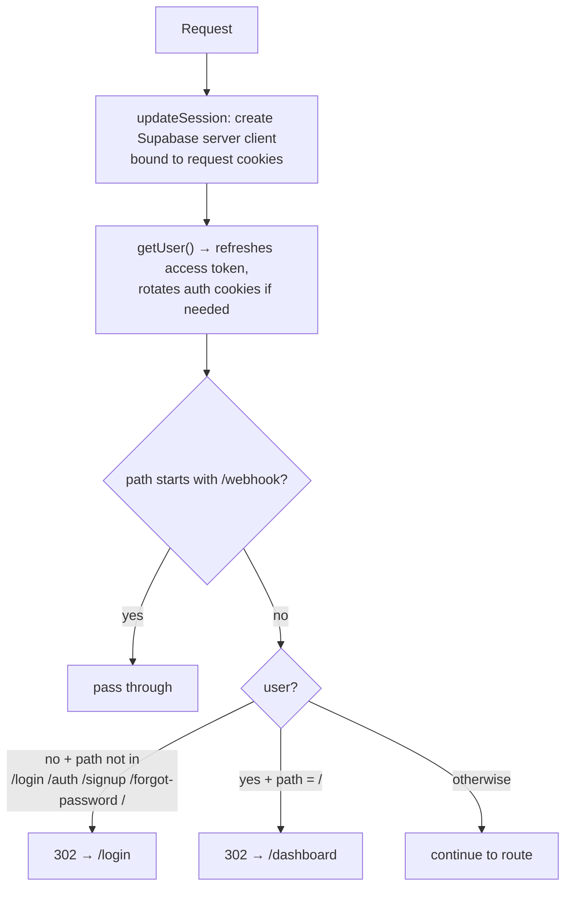
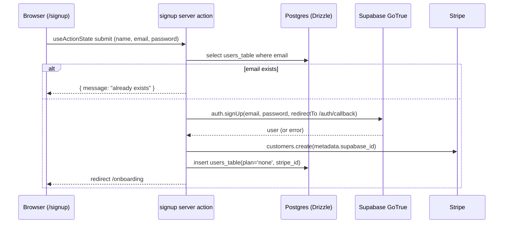
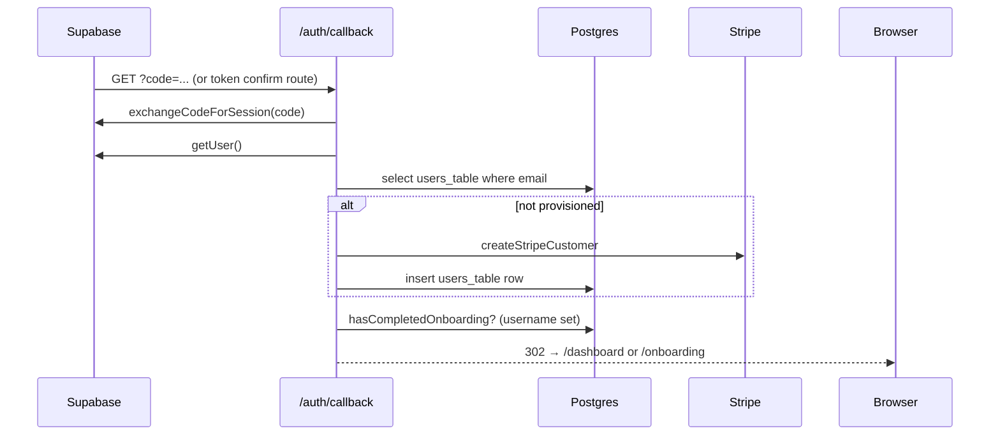
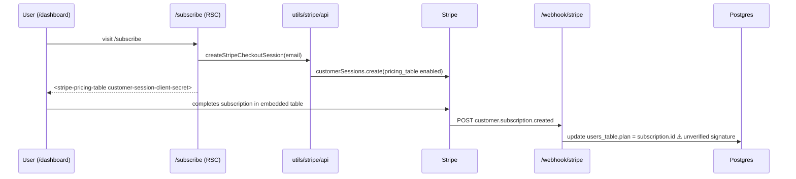
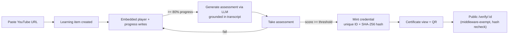

# ARCHITECTURE — getcertificate.today

|                 |                                                                                                       |
| --------------- | ----------------------------------------------------------------------------------------------------- |
| Document status | Living technical source of truth                                                                      |
| Last updated    | 2026-09-28                                                                                            |
| Basis           | Direct inspection of every non-generated source file, config, migration, and script in the repository |
| Related docs    | `PRD.md` (what & why), `RULES.md`, `DESIGN.md`, `TASK.md`, `MEMORY.md`                                |

This document describes the system **as it exists today**. Where a capability is planned but absent, it is explicitly labeled **[PLANNED]** and never blended into the as-built description.

---

## 1. System overview

getcertificate.today is a **single Next.js 16 application** (App Router) combining the marketing site, the authenticated app, server-side API routes, and (planned) public verification pages. It runs serverless on Vercel, uses **Supabase** (hosted Postgres + GoTrue auth) as its data/auth platform, **Drizzle ORM** for typed SQL access, and **Stripe** for subscriptions.

```
                     ┌──────────────────────────────────────────────┐
                     │                 Vercel (Node 20)             │
  Browser ──HTTPS──▶ │  Next.js 16 App Router (Turbopack build)     │
                     │  ├─ React Server Components (app/**)         │
                     │  ├─ Server Actions ("use server")            │
                     │  ├─ Route Handlers (/webhook/stripe, /auth)  │
                     │  └─ proxy.ts middleware (session refresh)    │
                     └──────┬───────────────┬──────────────┬────────┘
                            │               │              │
                   ┌────────▼─────┐  ┌──────▼─────┐  ┌─────▼──────┐
                   │ Supabase     │  │ Stripe API │  │ Google Fonts│
                   │ GoTrue auth  │  │ (REST)     │  │ (build time)│
                   │ + Postgres   │  └────────────┘  └────────────┘
                   │ (auth.* +    │        ▲
                   │  users_table)│        │ webhooks (unverified today)
                   └──────────────┘────────┘
```

**[PLANNED]** additions that will extend this topology: an LLM provider (assessment generation), YouTube embed/transcript access, a QR generation library, and public `/verify/**` pages served from the same app.

## 2. Technology stack (as installed, lockfile-resolved)

| Layer       | Technology                                                                                                             | Version (lockfile)                                 | Notes                                                                                                                                                                                                                                                                                                                                                                                                                                                                                                                                                                                     |
| ----------- | ---------------------------------------------------------------------------------------------------------------------- | -------------------------------------------------- | ----------------------------------------------------------------------------------------------------------------------------------------------------------------------------------------------------------------------------------------------------------------------------------------------------------------------------------------------------------------------------------------------------------------------------------------------------------------------------------------------------------------------------------------------------------------------------------------- |
| Framework   | Next.js (App Router)                                                                                                   | **16.3.6**                                         | Turbopack dev/build; `next dev`, `next build`                                                                                                                                                                                                                                                                                                                                                                                                                                                                                                                                             |
| UI runtime  | React / React DOM                                                                                                      | **18.3.1**                                         | `package.json` declares `^18` (Next 16's peer range also allows 19 — the project pinned 18.x). Nuance verified empirically: `useActionState` is **not** in stock React 18.3.1's own exports, but (a) Next 16 **vendors its own React** under `next/dist/compiled/react` and serves it at runtime, where `useActionState` exists, and (b) `@types/react` 18.3.31 ships `canary.d.ts` declarations that make it typecheck. So server-action forms work, but this is a Next-bundled-React capability, not a stock-React-18 one (commit `fcc23be` migrated `useFormState` → `useActionState`) |
| Language    | TypeScript                                                                                                             | 5.9.3                                              | `strict: true`; `target: ES2017`; `moduleResolution: bundler`                                                                                                                                                                                                                                                                                                                                                                                                                                                                                                                             |
| Styling     | Tailwind CSS                                                                                                           | 3.4.19                                             | `darkMode: ["class"]`; custom Figma tokens (see `DESIGN.md`)                                                                                                                                                                                                                                                                                                                                                                                                                                                                                                                              |
| Components  | shadcn/ui + Radix                                                                                                      | Radix dropdown-menu 2.1.x, label 2.1.x, slot 1.1.x | `components.json` style "default", RSC on, slate base                                                                                                                                                                                                                                                                                                                                                                                                                                                                                                                                     |
| Icons       | `lucide-react` 0.428, `react-icons` 5.3, **generated `components/icons.tsx`**                                          |                                                    | Landing-page icons are byte-exact Figma SVGs generated by `scripts/figma-icons-gen.py`                                                                                                                                                                                                                                                                                                                                                                                                                                                                                                    |
| Auth        | Supabase (`@supabase/ssr` 0.5.2, `supabase-js` 2.4x)                                                                   |                                                    | Cookie-based SSR sessions; Google + GitHub OAuth; email flows                                                                                                                                                                                                                                                                                                                                                                                                                                                                                                                             |
| Database    | Postgres (Supabase) via `postgres` (postgres.js) 3.4.x                                                                 |                                                    | `prepare: false` for transaction-pooler compatibility                                                                                                                                                                                                                                                                                                                                                                                                                                                                                                                                     |
| ORM         | Drizzle ORM 0.45.3 + drizzle-kit 0.31.11                                                                               |                                                    | Migrations in `utils/db/migrations`                                                                                                                                                                                                                                                                                                                                                                                                                                                                                                                                                       |
| Payments    | Stripe Node SDK 16.12.0                                                                                                |                                                    | Embedded pricing table + Customer Sessions + billing portal                                                                                                                                                                                                                                                                                                                                                                                                                                                                                                                               |
| Fonts       | `next/font/google` — Manrope, Fraunces                                                                                 |                                                    | Self-hosted at build time; CSS variables `--font-manrope`, `--font-fraunces`                                                                                                                                                                                                                                                                                                                                                                                                                                                                                                              |
| Lint/format | ESLint 9 (flat config, `eslint-config-next` core-web-vitals + typescript) / Prettier 3 + `prettier-plugin-tailwindcss` |                                                    | `npm run lint`, `npm run format`                                                                                                                                                                                                                                                                                                                                                                                                                                                                                                                                                          |
| Runtime     | Node 20.18.1 (`.nvmrc`); npm package manager                                                                           |                                                    |                                                                                                                                                                                                                                                                                                                                                                                                                                                                                                                                                                                           |
| Tests       | **None installed**                                                                                                     |                                                    | No test framework, no CI. Roadmap gap — `TASK.md`                                                                                                                                                                                                                                                                                                                                                                                                                                                                                                                                         |

Notably **absent** (do not assume otherwise): no Redux/Zustand (no client state library at all), no React Query/SWR, no tRPC, no Sentry/telemetry, no i18n library, no email service beyond Supabase's, no LLM SDK, no YouTube SDK, no QR library.

## 3. Repository structure

```
getcertificate.today/
├── app/                          # Next.js App Router — routes & pages
│   ├── layout.tsx                # Root layout: fonts, metadata, Stripe pricing-table script
│   ├── globals.css               # Tailwind layers + shadcn CSS variables (HSL)
│   ├── page.tsx                  # Marketing landing page (Figma frame 6:9, ISR 3600s)
│   ├── auth/
│   │   ├── actions.ts            # Server actions: signup/login/logout/OAuth/reset/onboarding
│   │   ├── callback/route.ts     # OAuth/email-code → session; provisions DB+Stripe row
│   │   └── auth/
│   │       ├── confirm/route.ts  # OTP token_hash verification (email confirm)
│   │       └── logout/route.ts   # POST sign-out → /login
│   ├── dashboard/
│   │   ├── layout.tsx            # Auth + onboarding gate; renders DashboardHeader
│   │   ├── page.tsx              # Greeting + voluntary upgrade card
│   │   └── actions.ts            # EMPTY placeholder file
│   ├── onboarding/page.tsx       # Profile completion form (server component + form)
│   ├── login|signup|forgot-password(4 pages)|subscribe|subscribe/success/
│   └── webhook/stripe/route.ts   # Stripe webhook receiver (UNVERIFIED; has fall-through bug)
├── components/
│   ├── icons.tsx                 # AUTO-GENERATED Figma SVG components (regen: scripts/figma-icons-gen.py)
│   ├── MobileNav.tsx             # Landing-page mobile nav disclosure (client)
│   ├── DashboardHeader.tsx       # Dashboard top bar (plan badge, nav, search)
│   ├── DashboardHeaderProfileDropdown.tsx  # Account menu incl. billing portal link, logout
│   ├── OnboardingForm.tsx        # Client form → completeOnboarding action
│   ├── LoginForm|SignupForm|ForgotPasswordForm|ResetPasswordForm.tsx
│   ├── ProviderSigninBlock.tsx   # OAuth buttons (render only if provider env set)
│   ├── StripePricingTable.tsx    # <stripe-pricing-table> custom element wrapper
│   └── ui/                       # shadcn primitives: button badge card dropdown-menu input label skeleton
├── utils/
│   ├── db/
│   │   ├── db.ts                 # postgres.js client + drizzle instance (module singleton)
│   │   ├── schema.ts             # Drizzle schema: users_table
│   │   └── migrations/           # Generated SQL + snapshot metadata (drizzle-kit)
│   ├── supabase/
│   │   ├── server.ts             # createServerClient bound to next/headers cookies
│   │   ├── client.ts             # createBrowserClient (currently unused by app code)
│   │   └── middleware.ts         # updateSession: refresh cookies + route protection
│   └── stripe/api.ts             # Stripe helpers: customer, checkout session, portal, plan lookup
├── lib/utils.ts                  # cn() (clsx + tailwind-merge)
├── proxy.ts                      # Next 16 middleware convention (exports proxy + config.matcher)
├── scripts/
│   ├── db-preflight.mjs          # Build-time DB reachability check (runs before migrate)
│   ├── demo-user.mjs             # Dev-only: SQL-crafted demo user (clones an auth.users row)
│   ├── test-onboarding-flow.mjs  # Dev-only end-to-end flow check against localhost:3000
│   ├── figma-icons-gen.py        # Regenerates components/icons.tsx from .media/images/*.svg
│   └── figma-tree-dump.py        # Dev tool: dumps Figma node geometry/styles to stdout
├── stripeSetup.ts                # One-off: seeds Stripe products/prices/webhook endpoint
├── figma-tokens.json             # Token export stub (empty tokens array)
├── .media/                       # Figma source-of-truth assets + bindings manifest + cache
├── public/                       # hero.png, logo.png, figma/{hero,logo}.png
├── compositions/components/landing-page/  # EMPTY directory (Figma import artifact)
├── figma-ui/                     # EMPTY directory (Figma import artifact)
├── docs/                         # This documentation set
└── (config) .env.example .nvmrc .prettierrc eslint.config.mjs next.config.mjs
             drizzle.config.ts tailwind.config.ts tsconfig.json components.json postcss.config.mjs
```

Conventions visible in the tree (enforced as rules in `RULES.md`):

- Routes in `app/**`; shared components in `components/` (flat for app-specific, `components/ui/` for shadcn primitives).
- Server-only integrations live under `utils/{db,supabase,stripe}` and are imported by server components/actions only.
- Path alias `@/*` maps to repo root (`tsconfig.json`).
- The auth server actions file (`app/auth/actions.ts`) is the single hub for auth/onboarding mutations.

## 4. Major modules & responsibilities

| Module                                      | Responsibility                                                                                              | Key exports / entry points                                                                                                                                 |
| ------------------------------------------- | ----------------------------------------------------------------------------------------------------------- | ---------------------------------------------------------------------------------------------------------------------------------------------------------- |
| `proxy.ts` + `utils/supabase/middleware.ts` | Per-request session refresh (cookie rotation) and coarse route protection                                   | `proxy(request)`, `config.matcher`                                                                                                                         |
| `app/auth/actions.ts`                       | All auth + onboarding mutations as Server Actions                                                           | `signup`, `loginUser`, `logout`, `signInWithGoogle`, `signInWithGithub`, `forgotPassword`, `resetPassword`, `completeOnboarding`, `hasCompletedOnboarding` |
| `app/auth/callback/route.ts`                | Exchanges OAuth/email code for session; provisions `users_table` row + Stripe customer for first-time users | `GET`                                                                                                                                                      |
| `app/auth/auth/confirm/route.ts`            | Verifies OTP (`token_hash` + `type`) for email confirmation links                                           | `GET`                                                                                                                                                      |
| `app/auth/auth/logout/route.ts`             | POST-based sign out with revalidation                                                                       | `POST`                                                                                                                                                     |
| `utils/supabase/{server,client}.ts`         | Typed Supabase client factories for RSC and browser contexts                                                | `createClient()`                                                                                                                                           |
| `utils/db/db.ts`                            | Single postgres.js + Drizzle instance (module singleton)                                                    | `db`                                                                                                                                                       |
| `utils/db/schema.ts`                        | Source of truth for table definitions                                                                       | `usersTable`, `InsertUser`, `SelectUser`                                                                                                                   |
| `utils/stripe/api.ts`                       | Stripe operations: customer creation, pricing-table Customer Session, billing portal URL, plan lookup       | `stripe`, `createStripeCustomer`, `createStripeCheckoutSession`, `generateStripeBillingPortalLink`, `getStripePlan`                                        |
| `app/webhook/stripe/route.ts`               | Receives subscription lifecycle events and syncs `users_table.plan`                                         | `POST`                                                                                                                                                     |
| `app/page.tsx`                              | Marketing landing (all copy/data inline constants)                                                          | default export (RSC)                                                                                                                                       |
| `app/dashboard/**`, `app/onboarding/**`     | Authenticated shell: gate, header, greeting, upgrade card                                                   | RSCs + client forms                                                                                                                                        |
| `components/icons.tsx`                      | Figma-exact inline SVG icons                                                                                | 6 icon components                                                                                                                                          |
| `components/ui/*`                           | shadcn primitives (unmodified except where noted)                                                           | Button, Badge, Card, DropdownMenu, Input, Label, Skeleton                                                                                                  |
| `lib/utils.ts`                              | Class-name merge helper                                                                                     | `cn`                                                                                                                                                       |
| `scripts/db-preflight.mjs`                  | Fails the build fast (with diagnostics) when `DATABASE_URL` is missing/unreachable                          | run by `npm run build`                                                                                                                                     |

## 5. Data layer

### 5.1 Physical schema (as shipped)

One application table exists (`users_table`, extended by migration `0001_add-profile-fields` with onboarding columns). Migrations live in `utils/db/migrations/` (generated by drizzle-kit; applied by `drizzle-kit migrate` in the build).

```ts
// utils/db/schema.ts
export const usersTable = pgTable('users_table', {
  id: text('id').primaryKey(), // Supabase auth user id (mirrors auth.users.id)
  name: text('name').notNull(),
  email: text('email').notNull().unique(),
  plan: text('plan').notNull(), // 'none' | <stripe subscription id>
  stripe_id: text('stripe_id').notNull(), // Stripe customer id
  username: text('username').unique(), // null until onboarding completes (migration 0001)
  first_name: text('first_name'),
  last_name: text('last_name'),
  dob: date('dob'),
});
```

Migration history: `0000_colossal_kree.sql` creates the base table (id, name, email, plan, stripe_id + email unique); `0001_add-profile-fields.sql` adds the four onboarding columns + username unique constraint.

**⚠️ Migration-application caveat (unverified, environment-dependent):** the migration chain on disk is complete and internally consistent (`0000` creates the base table; `0001` adds the onboarding columns; correct `prevId` linkage; valid journal timestamps — `0001` is dated 2026-09-28, the day of commit `a1bd15d`). What cannot be verified from the repository alone is whether each live database (local dev, production) has actually **applied** `0001` — a DB provisioned by `db:push` rather than `drizzle-kit migrate` would have the columns without the migration-history entry. A one-time per-environment verification is prudent before relying on migrations; see `TASK.md` Phase 0.1.

**Supabase-managed tables:** `auth.users`, `auth.identities`, `auth.sessions` etc. are owned by GoTrue. `users_table.id` mirrors `auth.users.id` by convention (set at insert; no FK enforced). The dev scripts in `scripts/` insert directly into `auth.users` for test seeding — dev-only, never app code.

### 5.2 Database access pattern

```ts
// utils/db/db.ts — module singleton; one pool per server instance
const client = postgres(process.env.DATABASE_URL!, { prepare: false });
export const db = drizzle(client);
```

- `prepare: false` is **required** for Supabase transaction/supavisor pool mode (comment in file).
- Queries are written inline with the query builder (`db.select()...`, `db.update()...`); there is **no repository/service layer** yet.
- **[PLANNED]** tables (none exist): `learning_items`, `progress`, `assessments`, `questions`, `attempts`, `credentials`. Naming should follow the existing lowercase snake_case style with the `_table` suffix only if consistency with `users_table` is preferred — decision recorded in `MEMORY.md`.

### 5.3 Migration workflow

```
edit utils/db/schema.ts → npm run db:generate → commit generated SQL
deployment: npm run build = node scripts/db-preflight.mjs && drizzle-kit migrate && next build
```

`drizzle.config.ts` loads `.env` in production, `.env.local` locally, and throws a clear error when `DATABASE_URL` is absent (Vercel build env must include it).

## 6. Authentication & session management

### 6.1 Client wiring

| Context                                      | Factory                                          | Cookie handling                                                                    |
| -------------------------------------------- | ------------------------------------------------ | ---------------------------------------------------------------------------------- |
| Middleware (`proxy.ts`)                      | `createServerClient` on the request              | Reads all request cookies; writes refreshed cookies onto both request and response |
| Server Components / Actions / Route Handlers | `createClient()` from `utils/supabase/server.ts` | Reads `next/headers` cookie store; attempts writes (ignored in RSC if read-only)   |
| Browser                                      | `createClient()` from `utils/supabase/client.ts` | Standard browser storage (currently unused — no client-side Supabase calls exist)  |

### 6.2 Middleware flow (`utils/supabase/middleware.ts` via `proxy.ts`)



Notes:

- The matcher excludes `_next/static`, `_next/image`, `favicon.ico`, and image files.
- `/webhook` is exempt **before** the user checks so Stripe's POST (no cookies) is not redirected.
- **Not exempt:** the planned public `/verify/**` pages will need an exemption added here **[PLANNED]** — recorded in `TASK.md`.
- Onboarding gating is _not_ done in middleware; it is enforced per-page (see 6.3).

### 6.3 Route protection layers (defense in depth, as built)

1. **Middleware** (above) handles unauthenticated access.
2. **Server components** independently call `supabase.auth.getUser()` and `redirect('/login')` (`app/dashboard/layout.tsx`, `app/dashboard/page.tsx`, `app/onboarding/page.tsx`, `app/subscribe/page.tsx`).
3. **Onboarding gate:** `hasCompletedOnboarding(userId)` (username non-null) redirects to `/onboarding` from `/dashboard` layout, `/`, and the auth callback; completed users hitting `/onboarding` are bounced to `/dashboard`.

### 6.4 Auth mutations (all in `app/auth/actions.ts`)

- `signup`: checks `users_table` for the email first (friendly duplicate error), calls `supabase.auth.signUp` with `emailRedirectTo: {PUBLIC_URL}/auth/callback`, provisions Stripe customer + DB row, redirects to `/onboarding`. Signup passes `email_confirm: NODE_ENV !== 'production'` inside user metadata — an apparent dev auto-confirm intent; actual confirmation behavior is governed by Supabase project settings, and this metadata field has no documented Supabase effect (treat as aspirational, not functional).
- `loginUser`: `signInWithPassword` → onboarding-aware redirect.
- `signInWithGoogle` / `signInWithGithub`: server-action-initiated OAuth redirect; providers render only when their env vars are set (`ProviderSigninBlock`).
- `forgotPassword` / `resetPassword`: Supabase recovery email → `/forgot-password/reset` → `exchangeCodeForSession` + `updateUser`.
- `logout`: signOut + redirect to `/login`; also available as POST route `/auth/auth/logout`.
- `completeOnboarding`: validates username regex `^[a-z0-9_]{3,20}$`, names, DOB (age ≥ 13 via UTC arithmetic), pre-checks username uniqueness (DB unique constraint remains the authority), updates `users_table`, `revalidatePath('/', 'layout')`, redirects.

### 6.5 Provisioning race (known design limitation)

A user's `users_table` row + Stripe customer are created in **two** places: the `signup` action and the OAuth `callback` route. Consequences: (a) email-confirmation users in production don't get a row until they confirm (callback), (b) OAuth users never hit `signup`, (c) two concurrent entry paths could double-create (mitigated only by the `email` unique constraint on the second insert, which currently surfaces as a raw error). Consolidating provisioning into the callback is the recommended fix — `TASK.md`.

## 7. Application routes (complete inventory)

| Route                                                                                                      | Type                          | Auth                                                               | Purpose / notes                                                                                                                                         |
| ---------------------------------------------------------------------------------------------------------- | ----------------------------- | ------------------------------------------------------------------ | ------------------------------------------------------------------------------------------------------------------------------------------------------- |
| `/`                                                                                                        | RSC (ISR `revalidate = 3600`) | Public (middleware bounces logged-in users to `/dashboard`)        | Marketing landing page                                                                                                                                  |
| `/login`, `/signup`                                                                                        | RSC + client forms            | Public                                                             | Auth forms + OAuth block                                                                                                                                |
| `/forgot-password`, `/forgot-password/success`, `/forgot-password/reset`, `/forgot-password/reset/success` | RSC                           | Public                                                             | Recovery flow pages                                                                                                                                     |
| `/auth/callback`                                                                                           | Route handler                 | Code exchange                                                      | Session exchange + provisioning + onboarding-aware redirect; error path redirects to **`/auth/auth-code-error` which does not exist** → 404 (known gap) |
| `/auth/auth/confirm`                                                                                       | Route handler                 | OTP token                                                          | Email confirmation links; error path redirects to **`/error` which does not exist** → 404 (known gap)                                                   |
| `/auth/auth/logout`                                                                                        | Route handler                 | Session                                                            | POST sign-out                                                                                                                                           |
| `/onboarding`                                                                                              | RSC + client form             | Required                                                           | Profile completion (gate both ways)                                                                                                                     |
| `/dashboard` (layout)                                                                                      | RSC                           | Required + onboarded                                               | Renders `DashboardHeader`                                                                                                                               |
| `/dashboard` (page)                                                                                        | RSC                           | Required + onboarded                                               | Greeting + voluntary upgrade card                                                                                                                       |
| `/subscribe`                                                                                               | RSC                           | Required                                                           | Stripe pricing table with Customer Session secret                                                                                                       |
| `/subscribe/success`                                                                                       | RSC                           | Middleware-protected (not on the public list); no page-level check | "Thank you" page → dashboard                                                                                                                            |
| `/webhook/stripe`                                                                                          | Route handler                 | Public (middleware-exempt; **signature unverified**)               | Subscription sync                                                                                                                                       |
| `/verify/**`, `/certificates/**`, `/learn/**`                                                              | —                             | —                                                                  | **Do not exist** [PLANNED]                                                                                                                              |
| `app/dashboard/actions.ts`                                                                                 | —                             | —                                                                  | **Empty file** (placeholder for future dashboard mutations)                                                                                             |

Metadata: root layout sets product title/description; `app/dashboard/layout.tsx` still carries starter-kit metadata (`"SAAS Starter Kit"`) — cosmetic debt. `app/favicon.ico` exists.

## 8. External integrations

### 8.1 Supabase

- Project URL + anon key via `NEXT_PUBLIC_SUPABASE_URL` / `NEXT_PUBLIC_SUPABASE_ANON_KEY` (anon key is public by design; service role key is **never** used anywhere).
- Provides: GoTrue auth (email/password, Google, GitHub, recovery, email confirm), hosted Postgres.
- Supabase dashboard config the app depends on: Site URL + redirect allowlist (`/auth/callback`, `/forgot-password/reset`), OAuth provider credentials.
- The Postgres connection string (`DATABASE_URL`) is used **directly by postgres.js/Drizzle** (not through Supabase's Data API), with `prepare: false` for pooler compatibility.

### 8.2 Stripe

- Secret key server-only (`STRIPE_SECRET_KEY`); publishable key + pricing-table ID are `NEXT_PUBLIC_*`.
- Embedded **Pricing Table** flow: `/subscribe` server component creates a **Customer Session** (`stripe.customerSessions.create` with `components.pricing_table.enabled`) and passes its `client_secret` to the `<stripe-pricing-table>` custom element (script loaded in root layout). This is the modern authenticated pricing-table flow — table confirms/starts subscription against the customer.
- **Billing portal** link is generated on demand in the dashboard dropdown; failures are swallowed and the item navigates to `#`.
- **Webhook** (`app/webhook/stripe/route.ts`) currently:
  - parses the event JSON from the request body **without verifying the Stripe signature** (no `stripe.webhooks.constructEvent`, no `STRIPE_WEBHOOK_SECRET` in env);
  - on `customer.subscription.created` sets `users_table.plan = subscription.id` by `stripe_id`, then **falls through** into the shared `customer.subscription.updated/deleted/default` branch because the `case` lacks a `break` (harmless today only because the shared branch does nothing);
  - treats `updated`/`deleted` as unhandled — so **cancellations never reset `plan`** and `deleted` leaves stale subscription IDs in the DB.
- `stripeSetup.ts` (manual one-off, run via `npm run stripe:setup`): seeds three starter products (Basic $10, Pro $20, Enterprise $50 — names suffixed `-Test` outside production), creates monthly prices + default price, registers the webhook endpoint in production mode. **These products do not match the product's Free/Pro tiers** shown on the landing page — reconciliation required before enabling quota gating (see `PRD.md` §14.6).
- Local dev: `npm run stripe:listen` forwards webhooks to `localhost:3000/webhook/stripe`.

### 8.3 Figma (design pipeline, not runtime)

- Landing page was implemented 1:1 from Figma file `ifCw9JuE00PMiaOHgtBxRp`, frame `6:9` ("landing-page", 1440×4477).
- `.media/` holds the audit trail: `manifest.jsonl` (asset provenance), `figma-bindings.jsonl` (Figma node → repo asset bindings), `figma-cache/figma-landing-page.json` + `figma-texts.txt` (node tree + copy), and exported SVGs/PNGs.
- `scripts/figma-icons-gen.py` regenerates `components/icons.tsx` (byte-exact paths, `stroke` → `currentColor`, `aria-hidden`); `scripts/figma-tree-dump.py` dumps geometry for verification.
- `figma-tokens.json` is an empty stub (Figma token API was enterprise-gated during import; token values were extracted from the node tree into `tailwind.config.ts` instead — see `DESIGN.md`).
- Figma is a **design-time** dependency only; nothing at runtime calls Figma.

### 8.4 Google Fonts

`next/font/google` (build-time self-hosting) for Manrope + Fraunces; no runtime requests.

## 9. Request/data flows

### 9.1 Signup (password) — as built



### 9.2 OAuth / email-code callback — as built



### 9.3 Subscription purchase — as built



### 9.4 [PLANNED] Core-loop flow (assessment → credential → verification)

No part of this flow is implemented; the shape below is the agreed target that `TASK.md` phases build toward, kept here so future sessions share one mental model:



## 10. State management

- **No client state library.** Cross-component state is server state.
- **Server state** lives in Postgres (`users_table`) and Stripe; read in RSCs via Drizzle/Stripe SDK.
- **Session state** lives in Supabase auth cookies, managed exclusively through `@supabase/ssr` factories and the middleware refresh.
- **Local UI state**: `useState` only (`MobileNav` open/close; form pending state via `useFormStatus`).
- **Form state**: `useActionState` + Server Actions (`{ message: string }` returned on validation failure; `redirect()` thrown on success) — see the React-version nuance in §2. Progressive enhancement works because actions run server-side on `<form action>`.
- **URL state**: only the auth flows use query params (`code`, `next`, `token_hash`, `type`).
- `revalidatePath('/', 'layout')` is called after auth/profile mutations so RSC caches don't serve stale identity data.

## 11. Rendering & caching strategy

| Surface                                   | Strategy                                                                                                                                          |
| ----------------------------------------- | ------------------------------------------------------------------------------------------------------------------------------------------------- |
| `/` landing                               | Static + ISR (`export const revalidate = 3600`); two `priority` Next Images (logo, hero); custom fonts via `next/font`                            |
| Auth pages                                | Dynamic (server components hitting cookies)                                                                                                       |
| `/dashboard`, `/onboarding`, `/subscribe` | Dynamic RSC; per-request Supabase/Drizzle/Stripe reads; `revalidatePath` after mutations                                                          |
| Images                                    | `next/image`; static imports from `/public`                                                                                                       |
| Script tags                               | Stripe pricing-table script `async` in root layout `<head>` (product-wide, even for pages that don't need it — acceptable, flagged as minor debt) |

## 12. Configuration & environments

### 12.1 Environment variables (authoritative list)

| Variable                                                 | Scope  | Used by                                         | Notes                                                                                       |
| -------------------------------------------------------- | ------ | ----------------------------------------------- | ------------------------------------------------------------------------------------------- |
| `NEXT_PUBLIC_SUPABASE_URL`                               | public | all Supabase clients                            |                                                                                             |
| `NEXT_PUBLIC_SUPABASE_ANON_KEY`                          | public | all Supabase clients                            | Must be the publishable key; `.env.example` warns never to expose `sb_secret_`/service-role |
| `NEXT_PUBLIC_WEBSITE_URL`                                | public | auth actions, stripe api, stripeSetup           | Redirect base; defaults to `http://localhost:3000`                                          |
| `DATABASE_URL`                                           | server | Drizzle, preflight, dev scripts                 | Postgres connection string (Supabase pooler-compatible)                                     |
| `GOOGLE_OAUTH_CLIENT_ID/SECRET`                          | server | Supabase dashboard config                       | Gates the Google button render (server reads presence via `process.env`)                    |
| `GITHUB_OAUTH_CLIENT_ID/SECRET`                          | server | Supabase dashboard config                       | Gates the GitHub button                                                                     |
| `STRIPE_SECRET_KEY`                                      | server | utils/stripe/api, stripeSetup, dev scripts      |                                                                                             |
| `NEXT_PUBLIC_STRIPE_PUBLISHABLE_KEY`                     | public | StripePricingTable                              |                                                                                             |
| `NEXT_PUBLIC_STRIPE_PRICING_TABLE_ID`                    | public | StripePricingTable                              |                                                                                             |
| **[PLANNED]** `STRIPE_WEBHOOK_SECRET`                    | server | webhook (after signature verification is added) | Missing today                                                                               |
| **[PLANNED]** LLM provider keys (e.g., `OPENAI_API_KEY`) | server | assessment generation                           | Not present                                                                                 |

Env loading convention (must stay consistent): production reads `.env`, development reads `.env.local` (see `drizzle.config.ts`, `scripts/db-preflight.mjs`, `stripeSetup.ts`, dev scripts). `.gitignore` excludes `.env*` except `.env.example`; `.env.example` documents the shape with placeholder values. A local `.env.local` also currently holds `FIGMA_TOKEN` (design tooling only, not app runtime).

### 12.2 npm scripts (authoritative)

| Script                                                 | Does                                                                                                         |
| ------------------------------------------------------ | ------------------------------------------------------------------------------------------------------------ |
| `dev`                                                  | `next dev` (Turbopack). A second concurrent dev server must use another port (see `dev-server.log` incident) |
| `build`                                                | `node scripts/db-preflight.mjs && drizzle-kit migrate && next build` — DB must be reachable at build time    |
| `start`                                                | `next start`                                                                                                 |
| `lint`                                                 | ESLint 9 flat config over repo                                                                               |
| `format` / `format:check`                              | Prettier (with Tailwind class sorting plugin)                                                                |
| `db:generate` / `db:migrate` / `db:push` / `db:studio` | drizzle-kit workflows                                                                                        |
| `stripe:setup`                                         | `tsx --env-file=.env stripeSetup.ts` product/price/webhook seeding                                           |
| `stripe:listen`                                        | Stripe CLI webhook forward to `localhost:3000/webhook/stripe`                                                |

No `typecheck` script exists — run `npx tsc --noEmit` (or rely on `next build`) for type verification.

## 13. Deployment architecture

- **Platform:** Vercel (inferred from README's deploy section, `scripts/db-preflight.mjs` diagnostics that name Vercel env-var settings, and the build-time DB migration design). No `vercel.json`, no Dockerfile, no other deploy config exists.
- **Build pipeline on deploy:** `db-preflight` (verify `DATABASE_URL` reachable — added because `drizzle-kit migrate` fails silently on unreachable DBs, commit `5cebb67`) → `drizzle-kit migrate` (apply pending migrations to the shared DB) → `next build` (Turbopack).
- **Runtime:** Node 20.x serverless functions; all data access is server-side; no edge runtime usage.
- **Database:** single shared Supabase Postgres instance (migrations run against it at build time — the build acts as the deploy gate).
- **Cron/jobs:** none.
- **Domains/envs:** production env reads `.env` semantics via `NODE_ENV=production` branches; Vercel project env vars are the real source (README instructs enabling them for Builds).

## 14. Security posture (as built — includes defects)

**Implemented safeguards:**

- Anon key only in client bundles; no service-role key anywhere in code.
- Server-only secrets (`DATABASE_URL`, `STRIPE_SECRET_KEY`) never imported in client components; Stripe helpers live under `utils/stripe` and are only imported by RSCs/actions.
- Route protection in depth (middleware + per-page `getUser()` + onboarding gate).
- Server Actions validate input server-side (username regex, DOB age, required fields) — client `pattern`/`required` attributes are UX only.
- Username uniqueness enforced by a DB unique constraint; the app's pre-check is advisory only.
- Webhook route is middleware-exempt deliberately so unauthenticated POSTs reach it.
- `.env*` git-ignored (except `.env.example`); secrets never printed by dev scripts.

**Known security defects (fix order in `TASK.md`):**

1. **Stripe webhook signature is not verified** — anyone can POST fake `subscription.created` events and set arbitrary users' `plan`. Must add `stripe.webhooks.constructEvent` + `STRIPE_WEBHOOK_SECRET` and read the raw body.
2. **Middleware passes `/webhook` through for everyone** (necessary for webhooks, but the handler itself must authenticate — see 1).
3. `console.log("event:", event)` in the webhook can write subscription payloads into logs — strip PII/noise once verified.
4. `users_table.dob` (PII) is stored and queried into client-rendered props (onboarding defaults); acceptable but must be excluded from any future public surface, and privacy policy is required (see `PRD.md` NFR-2).
5. Duplicate provisioning path (§6.5) can surface raw DB errors to users.
6. No rate limiting anywhere (login/progress/mutation endpoints) — acceptable pre-launch, plan before public credential issuance.

## 15. Architectural decisions & records (observed)

| #     | Decision                                                                                           | Rationale (evidence)                                                                                |
| ----- | -------------------------------------------------------------------------------------------------- | --------------------------------------------------------------------------------------------------- |
| ADR-1 | Next 16 App Router with RSC-first, Server Actions for mutations                                    | Whole codebase; commit `425b724` adopted the Next 16 `proxy` convention and async `cookies()`       |
| ADR-2 | Supabase SSR cookie sessions + middleware refresh                                                  | `utils/supabase/*`; standard `@supabase/ssr` pattern with careful cookie pass-through comments      |
| ADR-3 | Drizzle + postgres.js with `prepare: false`                                                        | Supabase transaction-pooler compatibility comment in `utils/db/db.ts`; migrations run at build time |
| ADR-4 | Build-time DB preflight + migrate                                                                  | Commits `f4cfd9f`, `5cebb67` — fail fast with clear errors on Vercel                                |
| ADR-5 | Stripe embedded pricing table via Customer Sessions (not hosted Checkout redirect)                 | `utils/stripe/api.ts` `customerSessions.create` + `StripePricingTable.tsx`                          |
| ADR-6 | Optional subscription ("voluntary upgrade")                                                        | Commit `a1bd15d`: dashboard shows upgrade card only; no forced paywall                              |
| ADR-7 | Landing page is generated Figma-bound with audit trail                                             | `app/page.tsx` comments; `.media/` bindings; `scripts/figma-icons-gen.py` for byte-exact icons      |
| ADR-8 | ESLint 9 flat config; React `useActionState` migration                                             | Commits `97e89f1`, `fcc23be`                                                                        |
| ADR-9 | **[PLANNED]** Verification pages public + middleware-exempt; scoring/progress server-authoritative | Required by PRD NFR-1/FR-F1; not yet implemented                                                    |

## 16. Known technical debt & gaps (summary; details in `TASK.md`)

1. ~~Schema/migration drift~~ Resolved on inspection: migration `0001_add-profile-fields.sql` exists (commit `a1bd15d`) and matches `schema.ts`. Remaining action is a one-time verification that each live DB has `0001` applied (§5.1 caveat) — tracked in `TASK.md` Phase 0.1.
2. Unverified webhook + fall-through `case` + unhandled `deleted` events (§8.2) — release blocker for billing integrity.
3. Missing error/404 surfaces: `/auth/auth-code-error` and `/error` are redirect targets that don't exist; no `app/not-found.tsx`, `app/error.tsx`, or `app/loading.tsx`.
4. Starter-kit residue: `app/dashboard/layout.tsx` metadata ("SAAS Starter Kit"), generic nav links (`Home/Projects/Tasks/Reports` → `#`), search input with no behavior, placeholder footer links, unused `app/dashboard/actions.ts` and `utils/supabase/client.ts` (fine to keep if intentionally reserved).
5. `stripeSetup.ts` products don't match real tiers.
6. No tests, no CI, no error tracking.
7. Lint/typecheck: last verified green at commit `97e89f1`; re-verify before release (no committed CI to guarantee it).
8. Typos in class names: `text-2x\l font-bold` in `app/signup/page.tsx` (broken Tailwind class, harmless visually but wrong).
